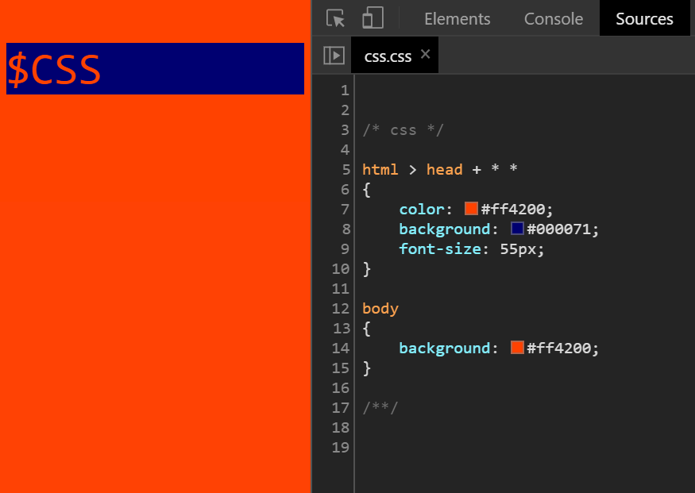

# $CSS
_CSS in PHP_


### ! In `.htaccess` add:

`AddType application/x-httpd-php .css`

### Input:

```php

<?header("Content-type:text/css");

/* variable */

$BLUE = '#000071';
$RED = '#ff4200';
$FS = 55;
$EL = 'html > head + * *';

/* - - - */

echo strtr('

/* css */

EL 
{
	color: RED;
	background: BLUE;
	font-size: FSpx;
}

body 
{
	background: RED;
}

/* - - - */

',get_defined_vars())?>

```

### Output:


